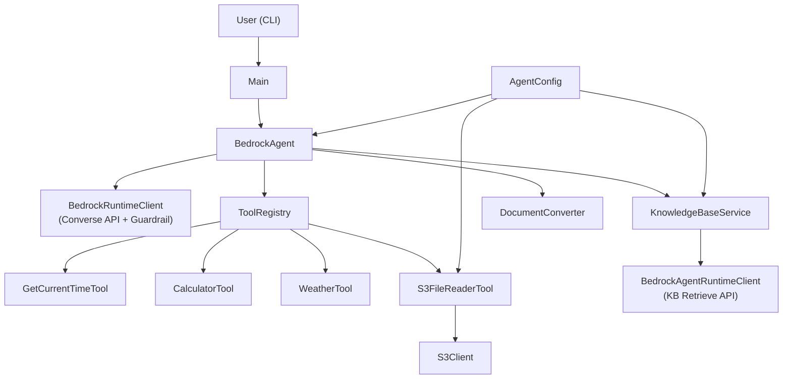
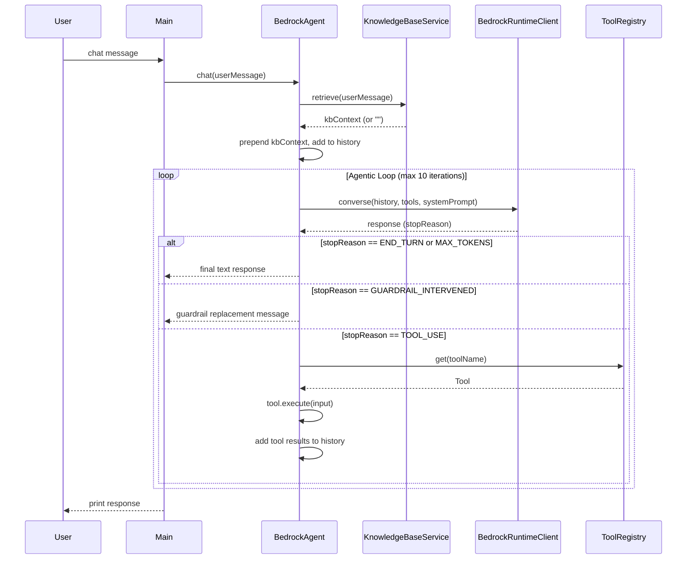

# Design Document

## Bedrock Java Agent

---

## Overview

The Bedrock Java Agent is a Java 21, Maven-based conversational AI agent that integrates with Amazon Bedrock. It exposes a CLI chat interface backed by Amazon Nova Pro via the Bedrock Converse API. The agent supports multi-turn conversation memory, native tool use (function calling), and Retrieval-Augmented Generation (RAG) via a Bedrock Knowledge Base backed by S3 documents.

The system is already implemented. This design document describes the architecture, components, data models, correctness properties, error handling strategy, and testing strategy for the feature as built.

### Key Design Goals

- **Extensibility**: New tools can be added by implementing the `Tool` interface and registering them — no changes to the core agent loop required.
- **Graceful degradation**: Knowledge Base and S3 features are optional; the agent continues to function when they are not configured.
- **Safety**: Tool inputs are validated before execution; path traversal and unsafe expression characters are rejected.
- **Simplicity**: Configuration is file-based (`config.properties`); no external config service is required.

---

## Architecture

The system follows a layered architecture with clear separation between the CLI entry point, the core agentic loop, tool execution, knowledge retrieval, and configuration.



### Agentic Loop Flow



---

## Components and Interfaces

### `Main` (CLI Entry Point)

- Loads `AgentConfig`, registers tools into `ToolRegistry`, initializes `KnowledgeBaseService` and `BedrockAgent`.
- Runs an interactive `Scanner`-based chat loop.
- Handles slash commands: `/reset`, `/quit`, `/exit`, `/q`, `/help`, `/?`.
- Prints configuration status at startup.
- Catches exceptions from `BedrockAgent.chat()` and prints to stderr without exiting.

### `BedrockAgent`

The core orchestrator. Responsibilities:
- Maintains `conversationHistory` (`List<Message>`) across turns.
- Calls `KnowledgeBaseService.retrieve()` before each turn and prepends context to the user message.
- Runs the agentic loop: calls Bedrock Converse API, handles `TOOL_USE` stop reason by executing tools and feeding results back, terminates on `END_TURN` or `MAX_TOKENS`.
- Caps the loop at `MAX_TOOL_ITERATIONS = 10` to prevent infinite loops.
- Attaches a `GuardrailConfiguration` to every Converse request when a guardrail is configured.
- Handles `GUARDRAIL_INTERVENED` stop reason by returning the guardrail's replacement message immediately.
- Exposes `resetConversation()` and `getConversationLength()`.

Key method signatures:
```java
public String chat(String userMessage)
public void resetConversation()
public int getConversationLength()
```

### `Tool` Interface

```java
public interface Tool {
    String getName();
    String getDescription();
    ObjectNode getInputSchema();   // JSON Schema for Bedrock tool config
    String execute(ObjectNode input);
}
```

All tools return plain-text strings. Error conditions are communicated via error strings (not exceptions) so the model can read and react to them.

### `ToolRegistry`

- Backed by a `LinkedHashMap<String, Tool>` (preserves insertion order for deterministic tool config).
- `register(Tool)` — throws `IllegalArgumentException` on duplicate name.
- `get(String name)` — returns `null` for unknown names.
- `getAll()` — returns all registered tools for building the Bedrock `ToolConfiguration`.

### `AgentConfig`

- Loads `config.properties` from the classpath at construction time.
- Throws `IllegalStateException` if the file is missing.
- Provides typed accessors with documented defaults:

| Property | Default |
|---|---|
| `aws.region` | `us-east-1` |
| `bedrock.model.id` | `amazon.nova-pro-v1:0` |
| `bedrock.max.tokens` | `1024` |
| `bedrock.knowledge.base.id` | `""` |
| `bedrock.knowledge.base.results` | `5` |
| `s3.default.bucket` | `""` |
| `agent.system.prompt` | `"You are a helpful AI assistant."` |
| `bedrock.guardrail.id` | `""` |
| `bedrock.guardrail.version` | `"DRAFT"` |

- `isKnowledgeBaseConfigured()` returns `false` when the KB ID is blank or equals `YOUR_KNOWLEDGE_BASE_ID`.
- `isS3Configured()` returns `false` when the bucket is blank or equals `YOUR_S3_BUCKET_NAME`.
- `isGuardrailConfigured()` returns `false` when the guardrail ID is blank or equals `YOUR_GUARDRAIL_ID`.

### `KnowledgeBaseService`

- Uses `BedrockAgentRuntimeClient` to call the Bedrock Knowledge Base Retrieve API.
- Returns an empty string when not configured or when no results are found.
- Formats results as a labeled context block with source filenames extracted from S3 URIs.
- Catches all exceptions and returns an empty string (graceful degradation).

### `DocumentConverter`

Bridges Jackson `JsonNode` ↔ AWS SDK `Document`:
- `toDocument(JsonNode)` — recursive conversion supporting boolean, number, string, array, object, null; falls back to `Document.fromString(node.toString())` for unhandled types.
- `documentToObjectNode(Document, ObjectMapper)` — serializes the Document to its JSON string and parses it with Jackson.

### Built-in Tools

#### `GetCurrentTimeTool` (`get_current_time`)
- Input: optional `timezone` (IANA name, defaults to UTC).
- Output: formatted date/time string or error string for invalid timezone.
- Format: `"EEEE, MMMM d, yyyy 'at' HH:mm:ss z"`

#### `CalculatorTool` (`calculator`)
- Input: required `expression` string.
- Safety: validates against regex `[0-9+\-*/().\s%eE]+` before evaluation.
- Evaluation: uses `ScriptEngine` (Nashorn/GraalJS); falls back to a simple single-operator evaluator if no engine is available.
- Output: `"Result: <value>"` or error string.

#### `S3FileReaderTool` (`s3_file_reader`)
- Input: required `key`, optional `bucket` (falls back to configured default).
- Security: rejects keys containing `..`.
- Content limit: truncates at 4000 characters with a notice.
- Output: file contents prefixed with `s3://bucket/key` URI, or error string.

#### `WeatherTool` (`get_current_weather`)
- Input: required `city` string.
- Flow: geocodes the city via the Open-Meteo Geocoding API, then fetches current conditions from the Open-Meteo Forecast API. No API key required.
- Output: formatted weather summary including temperature, feels-like, humidity, wind speed/direction, and WMO weather description; or error string.
- HTTP client: `java.net.http.HttpClient` with a 10-second timeout; package-private constructor accepts a pre-built client for testing.

---

## Data Models

### `Message` (AWS SDK)

The Bedrock Converse API uses `software.amazon.awssdk.services.bedrockruntime.model.Message`:

```
Message {
    role: ConversationRole  // USER or ASSISTANT
    content: List<ContentBlock>
}

ContentBlock (union type):
    text: String
    toolUse: ToolUseBlock { toolUseId, name, input: Document }
    toolResult: ToolResultBlock { toolUseId, content: List<ToolResultContentBlock> }
```

### Conversation History

```
conversationHistory: List<Message>
  [0] USER:      { text: "[KB context]\n\nUser question: <msg>" }
  [1] ASSISTANT: { toolUse: { toolUseId, name, input } }
  [2] USER:      { toolResult: { toolUseId, content: text } }
  [3] ASSISTANT: { text: "<final answer>" }
  ...
```

### Tool Input/Output Schema

Tools declare their input as a JSON Schema `ObjectNode`. Example for `calculator`:

```json
{
  "type": "object",
  "properties": {
    "expression": {
      "type": "string",
      "description": "The mathematical expression to evaluate"
    }
  },
  "required": ["expression"]
}
```

The schema is converted to an AWS SDK `Document` via `DocumentConverter.toDocument()` before being sent to Bedrock.

### `KnowledgeBaseRetrievalResult` (AWS SDK)

```
KnowledgeBaseRetrievalResult {
    content: { text: String }
    location: RetrievalResultLocation {
        s3Location: { uri: String }  // e.g. "s3://bucket/path/file.txt"
    }
    score: Double
}
```

### Configuration Properties

```
aws.region                      String   AWS region
bedrock.model.id                String   Bedrock model ARN/ID
bedrock.max.tokens              int      Max tokens per response
bedrock.knowledge.base.id       String   KB ID (empty = disabled)
bedrock.knowledge.base.results  int      Number of KB results to retrieve
s3.default.bucket               String   Default S3 bucket (empty = disabled)
agent.system.prompt             String   System prompt for the model
bedrock.guardrail.id            String   Guardrail ID (empty = disabled)
bedrock.guardrail.version       String   Guardrail version (default: DRAFT)
```

---

## Correctness Properties

*A property is a characteristic or behavior that should hold true across all valid executions of a system — essentially, a formal statement about what the system should do. Properties serve as the bridge between human-readable specifications and machine-verifiable correctness guarantees.*

### Property 1: Tool Registry Round-Trip

*For any* set of tools with distinct names, after registering all of them in the `ToolRegistry`, each tool must be retrievable by its exact name and `getAll()` must return a collection containing exactly those tools.

**Validates: Requirements 2.1, 2.2, 2.5**

---

### Property 2: Tool Registry Returns Null for Unknown Names

*For any* `ToolRegistry` state and any name string that was not registered, `get(name)` must return `null`.

**Validates: Requirements 2.3**

---

### Property 3: DocumentConverter Round-Trip

*For any* valid Jackson `ObjectNode` (including nested objects, arrays, strings, numbers, booleans, and nulls), converting to an AWS SDK `Document` via `DocumentConverter.toDocument()` and then back to an `ObjectNode` via `DocumentConverter.documentToObjectNode()` must produce a JSON structure equivalent to the original.

**Validates: Requirements 3.1, 3.2, 3.3**

---

### Property 4: Knowledge Base Context Formatting

*For any* non-empty list of `KnowledgeBaseRetrievalResult` objects with S3 URIs, the formatted context string returned by `KnowledgeBaseService` must contain the source filename extracted from each result's S3 URI.

**Validates: Requirements 4.3**

---

### Property 5: KB Context Prepended to User Message

*For any* user message string and any non-empty KB context string, the message added to the `BedrockAgent`'s conversation history must contain both the KB context and the original user message.

**Validates: Requirements 5.1**

---

### Property 6: Tool Use Results Added to History

*For any* set of tool use blocks returned by the Converse API, after the agent processes them, the conversation history must contain a user-role message with a tool result for every tool use block that was present in the response.

**Validates: Requirements 5.3**

---

### Property 7: Text Extraction from Assistant Messages

*For any* assistant `Message` containing one or more text `ContentBlock` entries, `extractTextFromMessage` must return the concatenation of all text blocks (trimmed).

**Validates: Requirements 5.6**

---

### Property 8: Conversation History Growth

*For any* sequence of N successful chat turns (each producing a final text response), the conversation history length must be at least 2×N (one user message and one assistant message per turn, plus any intermediate tool-use messages).

**Validates: Requirements 9.1, 9.4**

---

### Property 9: get_current_time Output Format

*For any* valid IANA timezone name, invoking the `get_current_time` tool must return a string that matches the pattern `"EEEE, MMMM d, yyyy 'at' HH:mm:ss z"` and contains the requested timezone name.

**Validates: Requirements 6.1**

---

### Property 10: get_current_time Error Contains Invalid Timezone

*For any* string that is not a valid IANA timezone name, invoking the `get_current_time` tool must return an error string that contains the invalid timezone string.

**Validates: Requirements 6.3**

---

### Property 11: Calculator Valid Expression Prefix

*For any* mathematical expression string that passes the safety regex (`[0-9+\-*/().\s%eE]+`), invoking the `calculator` tool must return a string that starts with `"Result: "`.

**Validates: Requirements 7.1**

---

### Property 12: Calculator Rejects Unsafe Expressions

*For any* expression string containing at least one character outside the allowed set `[0-9+\-*/().\s%eE]`, invoking the `calculator` tool must return an error string without evaluating the expression.

**Validates: Requirements 7.2**

---

### Property 13: Calculator Error Contains Original Expression

*For any* expression string that passes the safety check but causes an evaluation error (e.g., syntax error), the error response must contain the original expression string.

**Validates: Requirements 7.4**

---

### Property 14: S3 File Reader Truncation

*For any* file content string whose length exceeds 4000 characters, the `s3_file_reader` tool must return a result where the content portion is truncated at 4000 characters and the result contains a truncation notice.

**Validates: Requirements 8.2**

---

### Property 15: S3 File Reader Missing Key Error Contains URI

*For any* bucket name and key that result in a `NoSuchKeyException` from S3, the error response must contain the full S3 URI in the form `s3://bucket/key`.

**Validates: Requirements 8.5**

---

### Property 16: S3 File Reader General Error Contains Exception Message

*For any* exception thrown by the S3 client (other than `NoSuchKeyException`), the error response must contain the exception's message string.

**Validates: Requirements 8.7**

### Property 17: Weather Tool Missing City Parameter

*For any* invocation of the `get_current_weather` tool without a `city` parameter or with a blank value, the tool must return an error string without making any HTTP call.

**Validates: Requirements 11.2**

---

### Property 18: Weather Tool City Not Found

*For any* city name string that the geocoding API cannot resolve (returns empty results), the tool must return an error string containing the city name.

**Validates: Requirements 11.3**

---

### Property 19: Guardrail Attached When Configured

*For any* valid Guardrail ID and version, when a guardrail is configured, every `ConverseRequest` built by `BedrockAgent` must include a `GuardrailConfiguration` with the matching ID and version.

**Validates: Requirements 13.1**

---

### Property 20: No Guardrail Attached When Not Configured

*For any* `BedrockAgent` instance where the guardrail ID is blank or equals `YOUR_GUARDRAIL_ID`, every `ConverseRequest` built must not include a `GuardrailConfiguration`.

**Validates: Requirements 13.2**

---

## Error Handling

### Strategy

The system uses a two-tier error handling approach:

1. **Tool-level errors** — returned as plain-text error strings to the model. The model can read the error and decide how to respond (e.g., retry with different parameters, explain the issue to the user). No exceptions are thrown from tool `execute()` methods for expected error conditions.

2. **Agent-level errors** — unexpected exceptions from the Bedrock API are wrapped in `RuntimeException` and propagated to the CLI, which prints them to stderr and continues the chat loop.

### Error Conditions by Component

| Component | Condition | Behavior |
|---|---|---|
| `AgentConfig` | `config.properties` not found | Throws `IllegalStateException` at startup |
| `ToolRegistry` | Duplicate tool name registered | Throws `IllegalArgumentException` |
| `BedrockAgent` | Bedrock API call fails | Wraps in `RuntimeException`, propagates to CLI |
| `BedrockAgent` | Unknown tool requested by model | Returns error string to model |
| `BedrockAgent` | Tool `execute()` throws | Catches, logs, returns error string to model |
| `BedrockAgent` | Agentic loop hits 10 iterations | Returns fixed fallback message |
| `BedrockAgent` | `GUARDRAIL_INTERVENED` stop reason | Logs warning, returns guardrail replacement message |
| `KnowledgeBaseService` | KB API call fails | Logs error, returns empty string (graceful degradation) |
| `KnowledgeBaseService` | KB not configured | Returns empty string immediately |
| `GetCurrentTimeTool` | Invalid timezone | Returns error string containing the invalid timezone |
| `CalculatorTool` | Unsafe expression characters | Returns error string without evaluating |
| `CalculatorTool` | Missing `expression` parameter | Returns error string |
| `CalculatorTool` | Evaluation error | Returns error string containing original expression |
| `S3FileReaderTool` | Path traversal (`..` in key) | Returns error string, no S3 call made |
| `S3FileReaderTool` | Missing `key` parameter | Returns error string |
| `S3FileReaderTool` | S3 not configured, no bucket param | Returns error string |
| `S3FileReaderTool` | `NoSuchKeyException` | Returns error string with S3 URI |
| `S3FileReaderTool` | Other S3 exception | Logs error, returns error string with exception message |
| `WeatherTool` | Missing `city` parameter | Returns error string |
| `WeatherTool` | City not found by geocoding | Returns error string identifying the city |
| `WeatherTool` | API call fails | Logs error, returns error string with exception message |
| `DocumentConverter` | Unhandled `JsonNode` type | Falls back to `Document.fromString(node.toString())` |

### Logging

- SLF4J + Logback is used throughout.
- `DEBUG` level: conversation content, tool inputs/outputs, KB query details.
- `INFO` level: agent initialization, tool execution events.
- `WARN` level: unexpected stop reasons, max iteration reached.
- `ERROR` level: Bedrock API failures, tool exceptions, KB failures, S3 failures.

---

## Testing Strategy

### Overview

The testing strategy uses a dual approach:
- **Unit tests** for specific examples, edge cases, and error conditions.
- **Property-based tests** for universal properties that should hold across all valid inputs.

Property-based testing is appropriate here because the system contains pure functions (DocumentConverter, tool input validation, text formatting) and data structures (ToolRegistry) with clear universal properties. AWS service interactions are tested via mocks.

### Testing Library

**Property-based testing**: [jqwik](https://jqwik.net/) — a property-based testing library for Java that integrates with JUnit 5. Add to `pom.xml`:

```xml
<dependency>
    <groupId>net.jqwik</groupId>
    <artifactId>jqwik</artifactId>
    <version>1.8.4</version>
    <scope>test</scope>
</dependency>
<dependency>
    <groupId>org.junit.jupiter</groupId>
    <artifactId>junit-jupiter</artifactId>
    <version>5.10.2</version>
    <scope>test</scope>
</dependency>
```

**Mocking**: Mockito for mocking AWS SDK clients.

### Property-Based Tests

Each property test must run a minimum of **100 iterations** (jqwik default is 1000). Each test must include a comment referencing the design property it validates.

Tag format: `// Feature: bedrock-java-agent, Property <N>: <property_text>`

| Property | Test Class | Description |
|---|---|---|
| Property 1 | `ToolRegistryPropertyTest` | Tool registry round-trip |
| Property 2 | `ToolRegistryPropertyTest` | Null for unknown names |
| Property 3 | `DocumentConverterPropertyTest` | ObjectNode round-trip |
| Property 4 | `KnowledgeBaseServicePropertyTest` | KB context formatting |
| Property 5 | `BedrockAgentPropertyTest` | KB context prepended to history |
| Property 6 | `BedrockAgentPropertyTest` | Tool results added to history |
| Property 7 | `BedrockAgentPropertyTest` | Text extraction from messages |
| Property 8 | `BedrockAgentPropertyTest` | Conversation history growth |
| Property 9 | `GetCurrentTimeToolPropertyTest` | Output format for valid timezones |
| Property 10 | `GetCurrentTimeToolPropertyTest` | Error contains invalid timezone |
| Property 11 | `CalculatorToolPropertyTest` | Valid expression prefix |
| Property 12 | `CalculatorToolPropertyTest` | Rejects unsafe expressions |
| Property 13 | `CalculatorToolPropertyTest` | Error contains original expression |
| Property 14 | `S3FileReaderToolPropertyTest` | Content truncation |
| Property 15 | `S3FileReaderToolPropertyTest` | Missing key error contains URI |
| Property 16 | `S3FileReaderToolPropertyTest` | General error contains exception message |
| Property 17 | `WeatherToolPropertyTest` | Missing city parameter returns error without HTTP call |
| Property 18 | `WeatherToolPropertyTest` | City not found returns error containing city name |

### Unit Tests

Unit tests cover specific examples, edge cases, and integration points:

| Test Class | Coverage |
|---|---|
| `AgentConfigTest` | Config loading, defaults, sentinel value detection (1.1–1.6) |
| `ToolRegistryTest` | Duplicate registration exception, empty registry (2.1–2.5) |
| `DocumentConverterTest` | Each JsonNode type conversion, null handling, fallback (3.1, 3.4) |
| `KnowledgeBaseServiceTest` | Not configured returns empty, empty results returns empty, API failure returns empty (4.2, 4.4, 4.5) |
| `BedrockAgentTest` | Unknown tool error string, tool exception handling, max iterations fallback, API exception wrapping (5.4, 5.5, 5.7, 5.8) |
| `GetCurrentTimeToolTest` | UTC default, blank timezone default (6.2) |
| `CalculatorToolTest` | Missing expression parameter (7.3) |
| `S3FileReaderToolTest` | Path traversal rejection, missing key param, unconfigured S3 error, explicit bucket override (8.3, 8.4, 8.6, 8.8) |
| `WeatherToolTest` | Missing city parameter, API failure error string (11.2, 11.4) |
| `MainTest` | CLI command handling: /reset, /quit, /help, unknown command, empty input, exception handling (10.1–10.8) |

### Integration Tests

Integration tests verify end-to-end behavior with real or mocked AWS clients:

| Test | Description |
|---|---|
| `BedrockAgentIntegrationTest` | Full chat turn with mocked Bedrock client — verifies request contains history, system prompt, max tokens, and tool definitions (5.2, 9.2) |
| `S3FileReaderIntegrationTest` | File read with mocked S3 client — verifies URI prefix in response (8.1) |
| `KnowledgeBaseServiceIntegrationTest` | KB retrieval with mocked client — verifies top-N results returned (4.1) |
| `WeatherToolIntegrationTest` | Successful weather fetch with mocked HttpClient — verifies formatted output contains temperature, humidity, and wind fields (11.1) |

### Test Structure

```
src/test/java/com/example/agent/
├── config/
│   └── AgentConfigTest.java
├── tools/
│   ├── ToolRegistryTest.java
│   ├── ToolRegistryPropertyTest.java
│   ├── CalculatorToolTest.java
│   ├── CalculatorToolPropertyTest.java
│   ├── GetCurrentTimeToolTest.java
│   ├── GetCurrentTimeToolPropertyTest.java
│   ├── WeatherToolTest.java
│   ├── WeatherToolPropertyTest.java
│   ├── WeatherToolIntegrationTest.java
│   ├── S3FileReaderToolTest.java
│   └── S3FileReaderToolPropertyTest.java
├── knowledge/
│   ├── KnowledgeBaseServiceTest.java
│   └── KnowledgeBaseServicePropertyTest.java
├── util/
│   ├── DocumentConverterTest.java
│   └── DocumentConverterPropertyTest.java
├── BedrockAgentTest.java
├── BedrockAgentPropertyTest.java
└── MainTest.java
```
